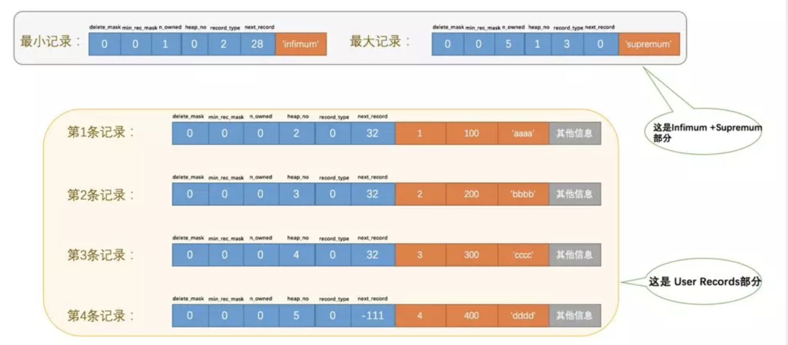

## InnoDB数据页结构

### 页的概念

    页是MySQL管理存储空间的基本单位，一个页的大小一般是16KB，
    我们的数据其实是被存放在页中的，如果数据占用的空间太大还可能造成行溢出现象，
    这会导致一条记录被分散存储在多个页中。
   
### 页的结构
页的本质就是一块16KB大小的存储空间，InnoDB为了不同的目的而把页分为不同的类型，其中用于存放记录的页也称为数据页，我们先看看这个用于存放记录的页长什么样。
数据页代表的这块16KB大小的存储空间可以被划分为多个部分，不同部分有不同的功能，各个部分如图所示：

从图中可以看出，一个InnoDB数据页的存储空间被划分成了7个部分，每个部分又可以被划分为若干小部分。下边我们用表格的方式来大致描述一下这7个部分

### 记录在页中的存储

在页的7个组成部分中，我们自己存储的记录会按照我们指定的行格式存储到User Records部分。但是在一开始生成页的时候，其实并没有User Records这个部分，每当我们插入一条记录，都会从Free Space部分，也就是尚未使用的存储空间中申请一个记录大小的空间划分到User Records部分，当Free Space部分的空间全部被User Records部分替代掉之后，也就意味着这个页使用完了，如果还有新的记录插入的话，就需要去申请新的页了，这个过程的图示如下：

为了更好的管理在User Records中的这些记录，MySQL可费了一番力气呢，在哪费力气了呢？不就是把记录按照指定的行格式一条一条摆在User Records部分么？其实这话还得从记录行格式的 记录头信息 中说起。

### 记录头信息的秘密
为了故事的顺利发展，我们先创建一个表：

	CREATE TABLE page_demo(
    ->     c1 INT,
    ->     c2 INT,
    ->     c3 VARCHAR(10000),
    ->     PRIMARY KEY (c1)
    -> ) CHARSET=ascii ROW_FORMAT=Compact;
    
这个新创建的page_demo表有3个列，其中c1和c2列是用来存储整数的，c3列是用来存储字符串的。需要注意的是，我们把 c1 列指定为主键，所以在具体的行格式中MySQL就没必要为我们去创建那个所谓的 row_id 隐藏列了。而且我们为这个表指定了ascii字符集以及Compact的行格式。所以这个表中记录的行格式示意图就是这样的：

记录头信息中各个属性的大体意思:

由于我们现在主要在唠叨记录头信息的作用，所以为了大家理解上的方便，我们只在page_demo表的行格式演示图中画出有关的头信息属性以及c1、c2、c3列的信息，简化后的行格式示意图就是这样：

下边我们试着向page_demo表中插入几条记录：

	INSERT INTO page_demo VALUES(1, 100, 'aaaa'), (2, 200, 'bbbb'), (3, 300, 'cccc'), (4, 400, 'dddd');
	
看看这些记录在页的User Records部分中是怎么表示的，为了方便大家分析，我把记录中头信息和实际的列数据都用十进制表示出来了（其实是一堆二进制位），所以这些记录的示意图就是：

* ` delete_mask `

这个属性标记着当前记录是否被删除，占用1个二进制位，值为0的时候代表记录并没有被删除，为1的时候代表记录被删除掉了。

	这些被删除的记录之所以不立即从磁盘上移除，是因为移除它们之后把其他的记录在磁盘上重新排列需要性能消耗，
	所以只是打个删除标记而已，而且这部分存储空间之后还可以重用，也就是说之后如果有新记录插入到表中的话， 
	可能把这些被删除的记录占用的存储空间覆盖掉。
	如果你想彻底的从磁盘上移除这些被删除的记录，可以使用这个语句：
	
	`optimize table 表名;`
	
	执行这个命令后服务器会重新规划表中记录的存储方式，把被标记为删除的记录从磁盘上移除。
	
	
* ` min_rec_mask `

这个属性标记该记录是否为B+树的非叶子节点中的最小记录，什么是个B+树？什么是个非叶子节点？好吧，等会再聊这个问题。反正我们自己插入的四条记录的min_rec_mask值都是0，意味着它们都不是B+树的非叶子节点中的最小记录。

* ` n_owned ` 

这个后面说

* ` heap_no `
 
这个属性表示当前记录在本页中的位置，从图中可以看出来，我们插入的4条记录在本页中的位置分别是：2、3、4、5。是不是少了点啥？是的，怎么不见heap_no值为0和1的记录呢？

其实是InnoDB自动给每个页里加了两个记录，由于这两个记录并不是我们自己插入的，所以有时候也称为伪记录或者虚拟记录。这两个伪记录一个代表最小记录，一个代表最大记录

不管我们向页中插入了多少自己的记录，设计InnoDB的大叔们都规定他们定义的两条伪记录分别为最小记录与最大记录。这两条记录的构造十分简单，都是由5字节大小的记录头信息和8字节大小的一个固定的部分组成的，如图所示

由于这两条记录不是我们自己定义的记录，所以它们并不存放在页的User Records部分，他们被单独放在一个称为Infimum + Supremum的部分，如图所示：

从图中我们可以看出来，最小记录和最大记录的heap_no值分别是0和1，也就是说它们的位置最靠前。

* ` record_type `

这个属性表示当前记录的类型，一共有4种类型的记录，0表示普通记录，1表示B+树非叶节点记录，2表示最小记录，3表示最大记录。从图中我们也可以看出来，我们自己插入的记录就是普通记录，它们的record_type值都是0，而最小记录和最大记录的record_type值分别为2和3。

至于record_type为1的情况，跟索引有关,在这就不谈论了。

* `next_record `

这玩意儿非常重要，它表示从当前记录的真实数据到下一条记录的真实数据的地址偏移量。比方说第一条记录的next_record值为36，意味着从第一条记录的真实数据的地址处向后找36个字节便是下一条记录的真实数据。这其实是个链表，可以通过一条记录找到它的下一条记录。但是需要注意注意再注意的一点是，下一条记录指得并不是按照我们插入顺序的下一条记录，而是按照主键值由小到大的顺序的下一条记录。而且规定 最小记录 的下一条记录就本页中主键值最小的记录，而本页中主键值最大的记录的下一条记录就是 最大记录 ，为了更形象的表示一下这个next_record起到的作用，我们用箭头来替代一下next_record中的地址偏移量：

从图中可以看出来，我们的记录按照从小到大的顺序形成了一个单链表。最大记录的next_record的值为0，这也就是说最大记录是没有下一条记录了，它是这个单链表中的最后一个节点。如果从中删除掉一条记录，这个链表也是会跟着变化的，比如我们把第2条记录删掉：

	DELETE FROM page_demo WHERE c1 = 2;
	
删掉第2条记录后的示意图就是：	

	所以，不论我们怎么对页中的记录做增删改操作，InnoDB始终会维护一条记录的单链表，链表中的各个节点是按照主键值由小到大的顺序连接起来的
	
主键值为2的记录被我们删掉了，但是存储空间却没有回收，如果我们再次把这条记录插入到表中，会发生什么事呢？

	INSERT INTO page_demo VALUES(2, 200, 'bbbb');
	
我们看一下记录的存储情况：
	

从图中可以看到，InnoDB并没有因为新记录的插入而为它申请新的存储空间，而是直接复用了原来被删除记录的存储空间。

### 页目录

我们从上了解到记录在页中按照主键值由小到大顺序串联成一个单链表，那如果我们想根据主键值查找页中的某条记录该咋办呢？比如说这样的查询语句：

	SELECT * FROM page_demo WHERE c1 = 3;
	
最笨的办法：从最小记录开始，沿着链表一直往后找，总有一天会找到
但是 InnoDB 肯定不会做这么笨的事,
它为我们的记录也制作了一个类似的目录，他们的制作过程是这样的：

	1:将所有正常的记录（包括最大和最小记录，不包括标记为已删除的记录）划分为几个组。

	2:每个组的最后一条记录的头信息中的n_owned属性表示该组内共有几条记录。

	3:将每个组的最后一条记录的地址偏移量按顺序存储起来，每个地址偏移量也被称为一个槽（英文名：Slot）。这些地址偏移量都会被存储到靠近页的尾部的地方，页中存储地址偏移量的部分也被称为Page Directory。

比方说现在的page_demo表中正常的记录共有6条，InnoDB会把它们分成两组，第一组中只有一个最小记录，第二组中是剩余的5条记录，看下边的示意图：

	

从这个图中我们需要注意这么几点：

* 现在Page Directory部分中有两个槽，也就意味着我们的记录被分成了两个组，槽0中的值是112，代表最大记录的地址偏移量；槽1中的值是99，代表最小记录的地址偏移量。

* 注意最小和最大记录的头信息中的n_owned属性

	* 最小记录的n_owned值为1，这就代表着以最小记录结尾的这个分组中只有1条记录，也就是最小记录本身。

	* 最大记录的n_owned值为5，这就代表着以最大记录结尾的这个分组中只有5条记录，包括最大记录本身还有我们自己插入的4条记录。

99和112这样的地址偏移量很不直观，我们用箭头指向的方式替代数字，单纯从逻辑上看一下这些记录和页目录的关系, 不管各条记录在存储设备上的排列方式了, 这样更易于我们理解，所以修改后的示意图就是这样：

这样看就顺眼多了嘛！为什么最小记录的n_owned值为1，而最大记录的n_owned值为5呢，这里头有什么猫腻么？

答案是肯定，InnoDB对每个分组中的记录条数是有规定的，对于最小记录所在的分组只能有 1 条记录，最大记录所在的分组拥有的记录条数只能在 1~8 条之间，剩下的分组中记录的条数范围只能在是 4~8 条之间。所以分组是按照下边的步骤进行的：

* 初始情况下一个数据页里只有最小记录和最大记录两条记录，它们分属于两个分组。

* 之后每插入一跳记录都把这条记录放到最大记录所在的组，直到最大记录所在组中的记录数等于8个。

* 在最大记录所在组中的记录数等于8个的时候再插入一条记录时，将最大记录所在组平均分裂成2个组，然后最大记录所在的组就剩下4条记录了，然后就可以把即将插入的那条记录放到该组中了。

由于现在page_demo表中的记录太少, 我们又往表中添加了12条记录，现在就一共有16条正常的记录了（包括最小和最大记录），这些记录被分成了5个组，如图所示(简化行数据结构 所以只保留了头信息中的n_owned和next_record属性)：

现在再从页目录中查找记录。因为各个槽代表的记录的主键值都是从小到大排序的，所以我们可以使用所谓的二分法来进行快速查找。

所以在一个数据页中查找指定主键值的记录的过程分为两步：

* 通过二分法确定该记录所在的槽。

* 通过记录的next_record属性组成的链表遍历查找该槽中的各个记录。

### Page Header

InnoDB为了能得到一个数据页中存储的记录的状态信息，比如本页中已经存储了多少条记录，第一条记录的地址是什么，页目录中存储了多少个槽等等，特意在页中定义了一个叫Page Header的部分，它是页结构的第二部分，这个部分占用固定的56个字节，专门存储各种状态信息

### File Header

如果说Page Header描述的是页内的各种状态信息，那么File Header描述的就是页外的各种状态信息，比方说这个页的编号是多少，它的上一个页、下一个页是谁啦吧啦吧啦～ 这两者的关系还真有点武警和解放军的关系。File Header是InnoDB页的第一部分，这个部分占用固定的38个字节

一张表中可以有成千上万条记录，一个页只有16KB，所以可能需要好多页来存放数据，FIL\_PAGE\_PREV'和 FIL\_PAGE\_NEXT 就分别代表本页的上一个和下一个页的页号。需要注意的是，并不是所有类型的页都有上一个和下一个页的属性，不过我们今天说的 (B+树叶子节点) 数据页是有这两个属性的，所以数据页其实是一个双链表，就像这样：

### File Trailer

我们知道InnoDB存储引擎会把数据存储到磁盘上，但是磁盘速度太慢，需要以页为单位把数据加载到内存中处理，如果该页中的数据在内存中被修改了，那么在修改后的某个时间需要把数据同步到磁盘中。但是在同步了一半的时候中断电了咋办，这不是莫名尴尬么？为了检测一个页是否完整（也就是在同步的时候有没有发生只同步一半的尴尬情况），InnoDB会在每个页的尾部都加了一个File Trailer部分，这个部分由8个字节组成，可以分成2个小部分：	

* 前四个字节代表页的校验和

	这个部分是和File Header中的校验和相对应的。每当一个页面在内存中修改了，在同步之前就要把它的校验和算出来，因为File Header在页面的前边，所以校验和会被首先同步到磁盘，当完全写完时，校验和也会被写到页的尾部，如果完全同步成功，则页的首部和尾部的校验和应该是一致的，反之意味着同步中间出了错。

* 后四个字节代表日志序列位置（LSN）

## 总结

1: InnoDB为了不同的目的而设计了不同类型的页，用于存放我么记录的页也叫做数据页。

2: 一个数据页可以被分为7个部分，分别是

* File Header，表示文件头，占固定的38字节。

* Page Header，表示页里的一些状态信息，占固定的56个字节。

* Infimum + Supremum，两个虚拟的伪记录，分别表示页中的最小和最大记录，占固定的26个字节。

* User Records：真实存储我们插入的记录的部分，大小不固定。

* Free Space：页中尚未使用的部分，大小不确定。

* Page Directory：页中的记录相对位置，也就是各个槽在页面中的地址偏移量，大小不固定，插入的记录越多，这个部分占用的空间越多。

* File Trailer：用于检验页是否完整的部分，占用固定的8个字节。

3: 每个记录的头信息中都有一个next_record属性，从而使页中的所有记录串联成一个单链表

4: InnoDB会为把页中的记录划分为若干个组，每个组的最后一个记录的地址偏移量作为一个槽，存放在Page Directory中，所以在一个页中根据主键查找记录是非常快的，分为两步：

* 通过二分法确定该记录所在的槽。

* 通过记录的next_record属性组成的链表遍历查找该槽中的各个记录。

5: 每个数据页的File Header部分都有上一个和下一个页的编号，所以所有的数据页会组成一个双链表。

6: 为保证从内存中同步到磁盘的页的完整性，在页的首部和尾部都会存储页中数据的校验和和LSN值，如果首部和尾部的校验和和LSN值校验不成功的话，就说明同步过程出现了问题。

	
