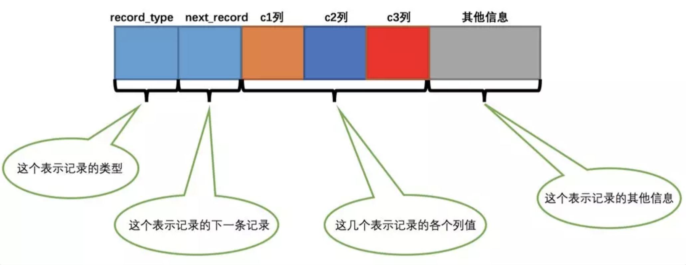
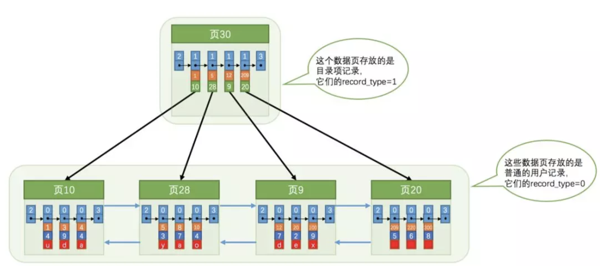
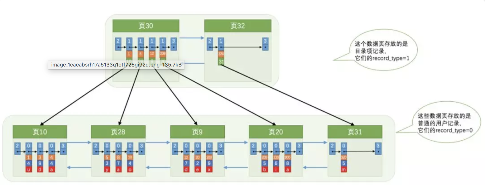
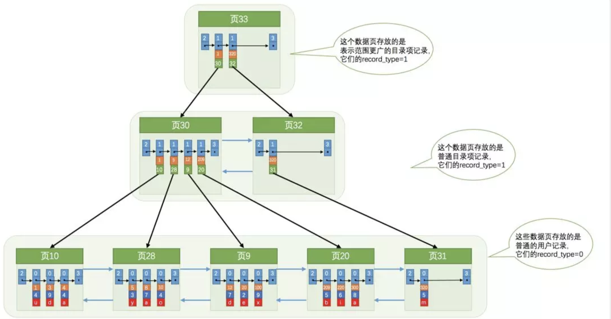
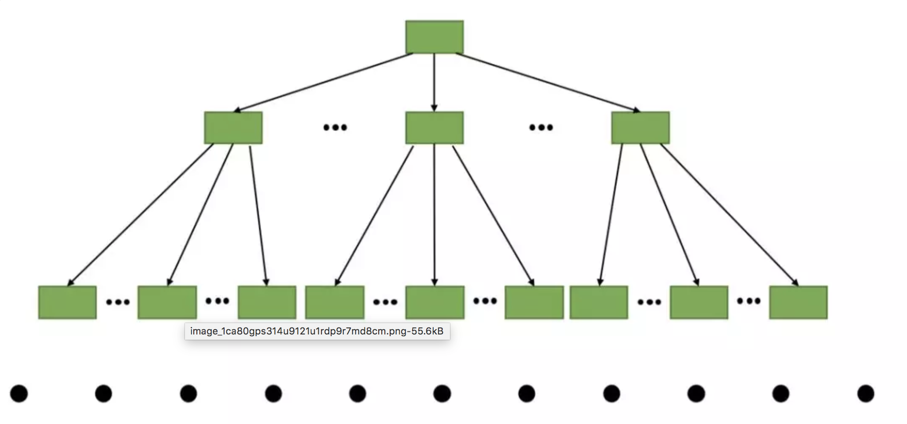
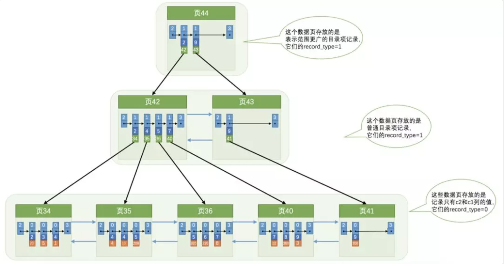
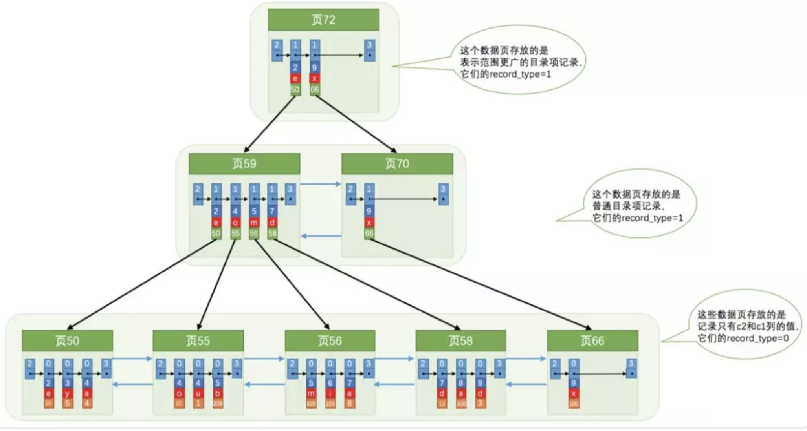

## InnoDB索引

### 索引的种类
* B+tree索引
	* 二级索引
	* 聚簇索引

* hash索引
* 空间数据索引(R-tree)
* 全文索引
* 其他类型索引
   
### 没有索引的查询
上周我们页的结构, 我们知道InnoDB 就是以页为单位的双向链表, 要想在查找一条数据, 只能从第一个页沿着双向链表一直往下找，在每一个页中根据页目录去查找指定的记录 (及全表扫描), 因为要遍历所有的数据页，所以这种方式显然是超级耗时的，如果一个表有一亿条记录，使用这种方式去查找记录那要等到猴年马月才能等到查找结果。

 因此我们需要一种方案解决这种问题--索引
 
 ### InnoDB中的索引方案
 
 为了故事的顺利发展，我们先建一个表：

	 CREATE TABLE index_demo(
    ->     c1 INT,
    ->     c2 INT,
    ->     c3 CHAR(1),
    ->     PRIMARY KEY(c1)
    -> ) ROW_FORMAT = Compact;
    
为了我们理解上的方便，我们简化了一下index_demo表的行格式示意图：    

 
 
###  InnoDB B+树索引
 
 InnoDB 索引其实和用户记录差不多，只不过目录项中的两个列是主键和页号而已，所以他们复用了之前存储用户记录的数据页来存储目录项，为了和用户记录做一下区分，我们把这些用来表示目录项的记录称为目录项记录。那InnoDB怎么区分一条记录是普通的用户记录还是目录项记录呢？通过record_type属性，它的各个取值代表的意思如下：
 
 * 0：普通的用户记录

 * 1：目录项记录

 * 2：最小记录

 * 3：最大记录

 我们在说页时候 record_type = 1 没有说, 原来这个值为1的record_type是这个意思呀, 我们把所索引放到数据页中的样子就是这样：

这就是我们主键索引的结构,从图中可以看出来，我们新分配了一个编号为30的页来专门存储目录项记录。这里再次强调一遍目录项记录和普通的用户记录的不同点：

* 目录项记录的record_type值是1，而普通用户记录的record_type值是0。

* 目录项记录只有主键值和页的编号两个列，而普通的用户记录的列是用户自己定义的，可能包含很多列，另外还有InnoDB自己添加的隐藏列。

* 还记得我们之前在记录头信息的时候说过一个叫min_rec_mask的属性么，只有在存储目录项记录的页中的主键值最小的目录项记录的min_rec_mask值为1，其他别的记录的min_rec_mask值都是0。

除了上述几点外，这两者就没啥差别了，它们用的是一样的数据页，页的组成结构也是一样一样的（就是我们前边介绍过的7个部分），都会为主键值生成Page Directory（页目录）以加快在页内的查询速度。所以现在根据某个主键值去查找记录的步骤可以大致拆分成下边两步，以查找主键为20的记录为例（因为都是从一个页中通过主键查某条记录，所以都可以使用Page Directory通过二分法而实现快速查找）:

* 先到存储目录项记录的页中通过二分法快速定位到对应目录项，因为12 < 20 < 209，所以定位到对应的记录所在的页就是页9.

* 从页9中根据二分法快速定位到主键值为20的用户记录。

虽然说目录项记录中只存储主键值和对应的页号，比用户记录需要的存储空间小多了，但是不论怎么说一个页只有16KB大小，能存放的目录项记录也是有限的，那如果表中的数据太多，以至于一个数据页不足以存放所有的目录项记录，该咋办呢？如下图:

因为存储目录项记录的页不止一个，所以如果我们想根据主键值查找一条用户记录大致需要3个步骤：

* 确定目录项记录页

* 通过目录项记录页确定用户记录真实所在的页。

* 在真实存储用户记录的页中定位到具体的记录。

那么问题来了，如果我们表中的数据非常多则会产生很多存储目录项记录的页，那我们怎么根据主键值快速定位一个存储目录项记录的页呢？如下:

总计结构(简化版):

这个就是一个完整的主键, 一颗 B+树;

从图中可以看出来，一个B+树的节点其实可以分成好多层，InnoDB讨论方便，规定最下边的那层，也就是存放我们用户记录的那层为第0层，之后依次往上加。上边我们做了一个非常极端的假设，存放用户记录的页最多存放3条记录，存放目录项记录的页最多存放4条记录，其实真实环境中一个页存放的记录数量是非常大的，假设，假设，假设所有的数据页，包括存储真实用户记录和目录项记录的页，都可以存放1000条记录，那么：

* 如果B+树只有1层，也就是只有1个用于存放用户记录的节点，最多能存放1000条记录。

* 如果B+树有2层，最多能存放1000×1000=1000000条记录。

* 如果B+树有3层，最多能存放1000×1000×1000=1000000000条记录。

* 如果B+树有4层，最多能存放1000×1000×1000×1000=1000000000000条记录。哇咔咔～这么多的记录！！！

所以一般情况下，我们用到的B+树都不会超过4层，那我们通过主键去查找某条记录最多只需要做4个页面内的查找

### 聚簇索引

我们上边介绍的B+树本身就是一个目录，或者说本身就是一个索引。它有两个特点：

1: 使用记录主键值的大小进行记录和页的排序，这包括三个方面的含义：

* 页内的记录是按照主键的大小顺序排成一个单向链表。

* 各个存放用户记录的页也是根据页中记录的主键大小顺序排成一个双向链表。

* 各个存放目录项的页也是根据页中记录的主键大小顺序排成一个双向链表。

2: B+树的叶子节点存储的是完整的用户记录。

所谓完整的用户记录，就是指这个记录中存储了所有列的值。

我们把具有这两种特性的B+树称为聚簇索引，所有完整的用户记录都存放在这个聚簇索引的叶子节点处。这种聚簇索引并不需要我们在MySQL语句中显式的去创建，InnoDB存储引擎会自动的为我们创建聚簇索引。另外有趣的一点是，在InnoDB存储引擎中，聚簇索引就是数据的存储方式（所有的用户记录都存储在了叶子节点），也就是所谓的索引即数据。

### 二级索引

聚簇索引只能在搜索条件是主键值时才能发挥作用，因为B+树中的数据都是按照主键进行排序的。那如果我们想以别的列作为搜索条件该咋办呢？

我们可以多建几棵B+树，不同的B+树中的数据采用不同的排序规则。比方说我们用c2列的大小作为数据页、页中记录的排序规则，再建一棵B+树，效果如下图所示：

这个B+树与上边介绍的聚簇索引有几处不同：

* 使用记录c2列的大小进行记录和页的排序，这包括三个方面的含义：

	* 页内的记录是按照c2列的大小顺序排成一个单向链表。

	* 各个存放用户记录的页也是根据页中记录的c2列大小顺序排成一个双向链表。
	
	* 各个存放目录项的页也是根据页中记录的c2列大小顺序排成一个双向链表。
	
* B+树的叶子节点存储的并不是完整的用户记录，而只是c2列+主键这两个列的值

* 目录项记录中不再是主键+页号的搭配，而变成了c2列+页号的搭配。

所以如果我们想根据c2列的值查找到完整的用户记录的话，仍然需要到聚簇索引中再查一遍，这个过程也被称为回表。也就是根据c2列的值查询一条完整的用户记录需要使用到2棵B+树！！！	

### 联合索引

我们也可以同时以多个列的大小作为排序规则，也就是同时为多个列建立索引，比方说我们想让B+树按照c2和c3列的大小进行排序，这个包含两层：

* 先把各个记录和页按照c2列进行排序。

* 在记录的c2列相同的情况下，采用c3列进行排序

为c2和c3列建立的索引的示意图如下：

如图所示，我们需要注意一下几点：

* 每条目录项记录都由c2、c3、页号这三个部分组成，各条记录先按照c2列的值进行排序，如果记录的c2列相同，则按照c3列的值进行排序。

* B+树叶子节点处的用户记录由c2、c3和主键c1列组成。

### 总结

1: 对于InnoDB存储引擎来说，在单个页中查找某条记录分为两种情况：

* 以主键为搜索条件，可以使用Page Directory通过二分法快速定位相应的用户记录。

* 以其他列为搜索条件，需要按照记录组成的单链表依次遍历各条记录。

2: 没有索引的情况下，不论是以主键还是其他列作为搜索条件，只能沿着页的双链表从左到右依次遍历各个页。

3: InnoDB存储引擎的索引是一棵B+树，完整的用户记录都存储在B+树第0层的叶子节点，其他层次的节点都属于内节点，内节点里存储的是目录项记录。InnoDB的索引分为两大种：

* 聚簇索引

	以主键值的大小为页和记录的排序规则，在叶子节点处存储的记录包含了表中所有的列。

* 二级索引

	以自定义的列的大小为页和记录的排序规则，在叶子节点处存储的记录内容是列 + 主键。
	
4: B+树索引在空间和时间上都有代价，所以没事儿别瞎建索引。

5: B+树索引适用于下边这些情况：

* 全值匹配

* 匹配左边的列

* 匹配范围值

* 精确匹配某一列并范围匹配另外一列

* 用于排序

* 用于分组

6 在使用索引时需要注意下边这些事项：

* 只为用于搜索、排序或分组的列创建索引

* 为列的基数大的列创建索引

* 索引列的类型尽量小

* 可以只对字符串值的前缀建立索引

* 只有索引列在比较表达式中单独出现才可以适用索引

* 为了尽可能少的让聚簇索引发生页面分裂和记录移位的情况，建议让主键拥有AUTO_INCREMENT属性。

* 定位并删除表中的重复和冗余索引

* 尽量适用覆盖索引进行查询，避免回表带来的性能损耗。

